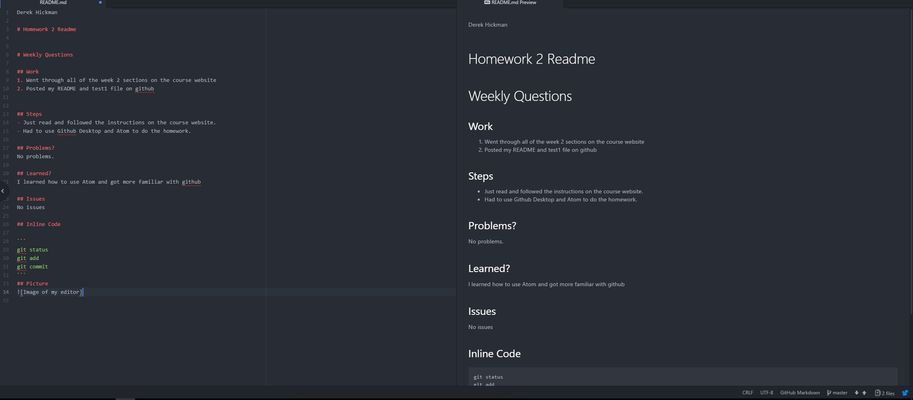

Derek Hickman

# Homework 2 Readme


# Weekly Questions

## Work
1. Went through all of the week 2 sections on the course website
2. Posted my README and test1 file on github


## Steps
- Just read and followed the instructions on the course website.
- Had to use Github Desktop and Atom to do the homework.

## Problems?
No problems.

## Learned?
I learned how to use Atom and got more familiar with github

## Issues
No issues

## Inline Code

```
git status
git add
git commit
```
## Picture

